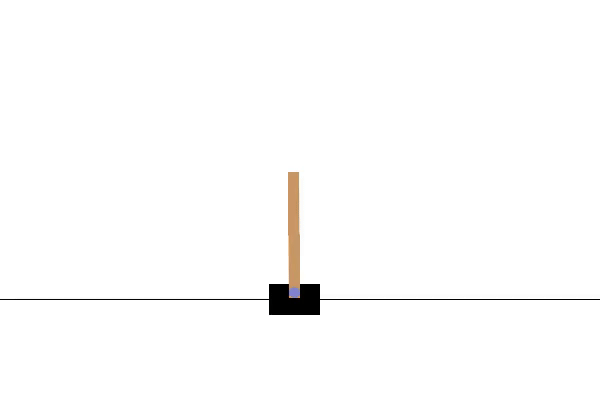

# 🚀 Forward-Forward RL: Backprop-Free Deep Reinforcement Learning

> **EPFL Project · Robotics & Data Science**  
> **Author :** Robin Junod · **Supervisor :** Giulio Romanelli

[](https://www.python.org/)  [](https://pytorch.org/)  [](LICENSE)

*Re-imagining Deep Q-Learning without gradients—powered by Geoffrey Hinton’s **Forward-Forward** Algorithm.*

---

## ✨ Why this repo might grab your attention

- **Gradient-free training** for RL — no back-prop
- Three **self-contained experiments**  
  1. **Survival-Focused Algo (Vanilla CartPole)**  
  2. **DDQN on CartPole (Vector-World)**  
  3. **DDQN on Breakout (Image/CNN World)**
- End-to-end Atari self playing agent (Breakout 🕹) + classic control (CartPole)
- Clean, reproducible code with  **PyTorch**, **Gymnasium**, <abbr title="Weights & Biases">wandb</abbr> logging

---

## 🎥 Results Demo Breakout

<p align="center">
  
</p>

<p align="center">
  
</p>


---

## 🗺️ Repo Tour

| Folder | Experiment |
|--------|------------|
| **code/Survival_Focused** | **1 · Survival-Focused Algo (Vanilla CartPole)** |
| **code/Simple_DQN**       | **2 · DDQN on CartPole (Vector-World)** |
| **code/Advanced_DQN**     | **3 · DDQN on Breakout (Image/CNN World)** |
| **results/**              | 📊 Plots, 📽 GIFs & videos |

---

## ⚡ Quick-Start

```bash
# 1 — clone
git clone https://github.com/RobinJunod/FF_DRL
cd FF_DRL

# 2 — create *identical* environment
conda env create -f environment.yml
conda activate ...
```


## 📑 Detailed Results
[Take a look at the FULL report for this project](results/Forward_Forward_algorithm_for_reinforcement_learning.pdf)

### 1 survival focused


### 2 ddqn cartpole (vector world, MLP)


### 3 ddqn breakout (image world, CNN/MLP)

