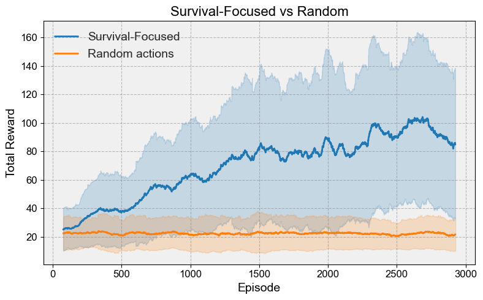
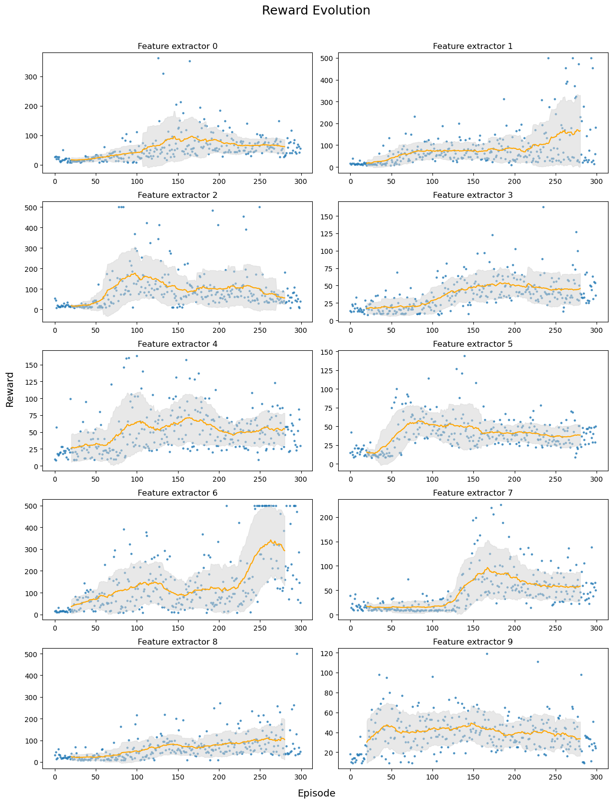
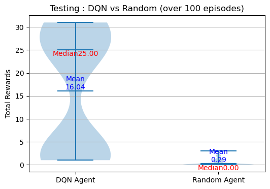
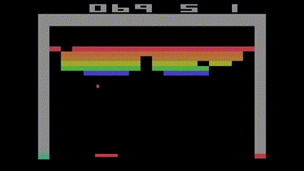
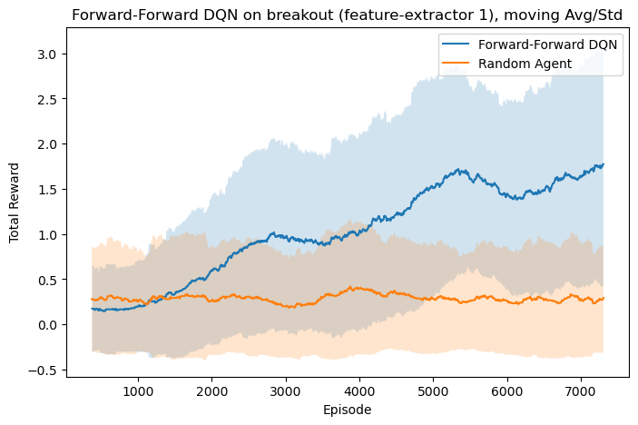

# FF_DRL

- train DQN cartpole with SB3
- train DQN cartpole with FF
- train DQN breakout with SB3
- train DQN breakout with FF (3 methods for generating negative data)
- ablation studies
- (blurring on MNIST and convolutional network, to show that blurring works as a technique to generate negative data)

This Repo is an attempt to solve gym env using the forwardforward leanring metho from g.hinton. Autors Robin Junod, supervised by Giulio Romanelli. This is a semester project at the EPFL, Master (robotic/datascience). Keywords : Breakout , Forward-Forward, Cartpole, Atari games, DQN ,Double DQN, replay memeory

It can be devided in 3 parts

1 survival focused , cartpole 
2 DQN , cartpole 
3 DQN with CNN, breakout

## Installation and depedencies
packages needed: pytorch, sklearn, pandas, numpy, gymnasium, gym atari (New version), matplotlib

To have the exact same env : `conda env create -f environment.yml`, `conda activate my_project_env`

# Part 1 : survival-focused
Promissing results have been achieved with a really straightfowrad implementation on the simple cartpole env. Go in the folder code/Survival_Focused
## Run the training phase
Run the fowrad-forward network train on vanilla ds : `python FF_network.py`

Run training for Surv-Focused in bash: `./run_exp.sh`

Or Run the python file directly : `python DRL_model_SurvivalFocused.py`

### Command-line Arguments

- `--memory_capacity`: (Type: int, Default: 10000) Memory capacity in the positive and negative list.
- `--num_episodes`: (Type: int, Default: 200) Number of episodes.
- `--num_epochs`: (Type: int, Default: 50) Number of epochs.
- `--epsilon_start`: (Type: int, Default: 1) Epsilon greedy start.
- `--epsilon_end`: (Type: int, Default: 0.1) Epsilon greedy end.
- `--theta_start`: (Type: int, Default: 5) Theta, the death horizon start.
- `--theta_end`: (Type: int, Default: 25) Theta, the death horizon end.
- `--train_e`: (Type: bool, Default: False) Train epsilon.

*Note: Uncomment the relevant lines in your script before using.*

## Run the inference 
in the file DRL_model_SurvivalFocused.py their is the function : test_policy(env, ff_net_trained, save_vid=True) for this purpuse.

## Results

# Part 2 : simple DQN
This adapts the FF to the well knwon DQN algorithm. It also proposes a way to solve a regression task with FF.

## Run the training phase
Run the Regression FF : `python FF_regression.py`

This scripts comes with the follwing parsers
- `--train_ff`: *(type: bool, default: True)* If set to `True`, the model will be trained using the foward-forward (FF) method.

- `--train_bp`: *(type: bool, default: False)* If set to `True`, the model will be trained using the backpropagation (BP) method.

- `--num_epochs`: *(type: int, default: 100)* Specifies the number of training epochs for the model.

Run the forwrad-forward DQN : `python DRL_model_Qlearning.py`

## Run the inference 
TODO

## Results

# Part 3 : Advanced DQN
This is an attempt of solving mroe complex env like breakout. This kind of env are interessting because they are dealing with images, and requires CNN to be efficient. 

## Run the training phase
Train the Forward Forward with CNN : `python FF_CNN.py`

Train Breakout DQN with BP : `python train_backpropagation.py`

Train Breakout DQN with FF : `python train_forwardforward.py`

## Run the inference 
Test Breakout DQN with BP : `python test_backpropagation.py`

Test Breakout DQN with FF : `python test_forwradforward.py`
## Results
The DQN with BP performs good : 

The FF early results are promissing, This part must be explorered a bit more :

